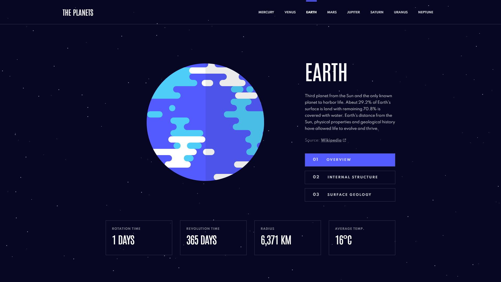

# Frontend Mentor - Planets fact site



## Table of contents

- [Overview](#overview)
  - [Intro](#intro)
  - [The challenge](#the-challenge)
  - [Links](#links)
- [My process](#my-process)
  - [Built with](#built-with)
  - [Features](#features)
- [Setup](#setup)
- [Useful resources](#useful-resources)

## Overview

### Intro

Hello! This is my solution to the [Planets fact site challenge](https://www.frontendmentor.io/challenges/planets-fact-site-gazqN8w_f) by Frontend Mentor. This project was built using **React JS** and leverages the power of **styled-components** for styling. While working on this project, I explored and learned more about using styled-components efficiently to manage CSS within React components.

### The challenge

> Your challenge is to build out this 8-page planets fact site and get it looking as close to the design as possible.
>
> You can use any tools you like to help you complete the challenge. So if you've got something you'd like to practice, feel free to give it a go.
>
> If you choose to use a JS-heavy approach, we provide a local `data.json` file for the planets. This means you'll be able to pull the data from there instead of using the separate `.html` files.
>
> Your users should be able to:
>
> - View the optimal layout for the app depending on their device's screen size
> - See hover states for all interactive elements on the page
> - View each planet page and toggle between "Overview", "Internal Structure", and "Surface Geology"

### Links

- [LIVE PREVIEW](https://planets-fact.andyvo.dev//) to check my solution.

- [Frontend Mentor](https://www.frontendmentor.io) challenges allow you to improve your skills in a real-life workflow.

## My process

### Built with

- ReactJS
- Anime.js
- SASS/SCSS
- JavaScript
- CSS Grid

### What I Learned

This project was a super cool learning experience for me! It was my first time diving into ReactJS for building dynamic user interfaces, and I had a blast exploring all the possibilities it offers. Anime.js was totally new to me too—I got to add some awesome animations to my project using timelines and easing functions. Plus, styled-components was a game-changer for managing styles right inside my React components, which made everything feel more organized and modern. I loved working with these technologies and can't wait to use them more in future projects

### Features

- Developed using ReactJS to create a modular and maintainable application structure.
- Leveraged styled-components to encapsulate CSS within individual components, providing a more manageable styling approach.
- Incorporated Anime.js for animations to enhance the user interface and provide engaging interactions.
- Utilized SASS/SCSS for enhanced styling capabilities and modularity.

## Setup

To run this project locally, follow these steps on bash:

```
git clone git@github.com:monstermaash/planets-fact.git
cd planets-fact
```

Install dependencies:

```
npm install
```

Start the development server:

```
npm run dev
```

## Useful resources

- [DOCS - ReactJS](https://reactjs.org/)
- [VIDEO - ReactJS tutorial by The Net Ninja](https://www.youtube.com/watch?v=j942wKiXFu8&list=PL4cUxeGkcC9gZD-Tvwfod2gaISzfRiP9d)
- [DOCS - Anime.js](https://animejs.com/documentation//)
- [LINK - Styled-components](https://styled-components.com/)
- [DOCS - SASS](https://sass-lang.com/documentation/)
- [DOCS - Javascript](https://developer.mozilla.org/en-US/docs/Web/JavaScript/)
- [DOCS - CSS Grid Layout](https://developer.mozilla.org/en-US/docs/Web/CSS/CSS_Grid_Layout/)
- [LINK - Prettier](https://prettier.io/)
